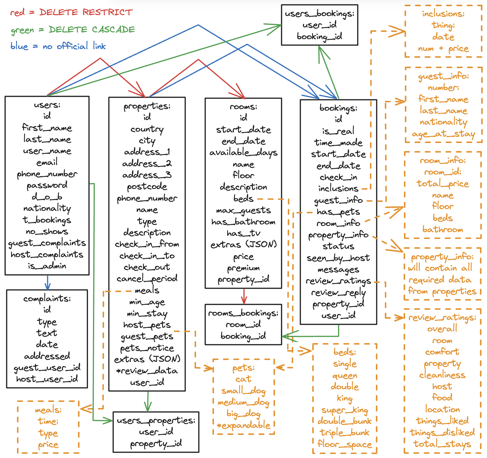

# Shuffle Shack Project

## Project Overview
I am embarking on a project inspired by the AirBNB model, with a focus on enhancing my skills in designing and programming PostgreSQL databases using SQLAlchemy. This backend-centric project aims to replicate a real-world application, incorporating a diverse range of features to add complexity to the database structure. Below is the detailed plan for the database that underpins this web application.

    

